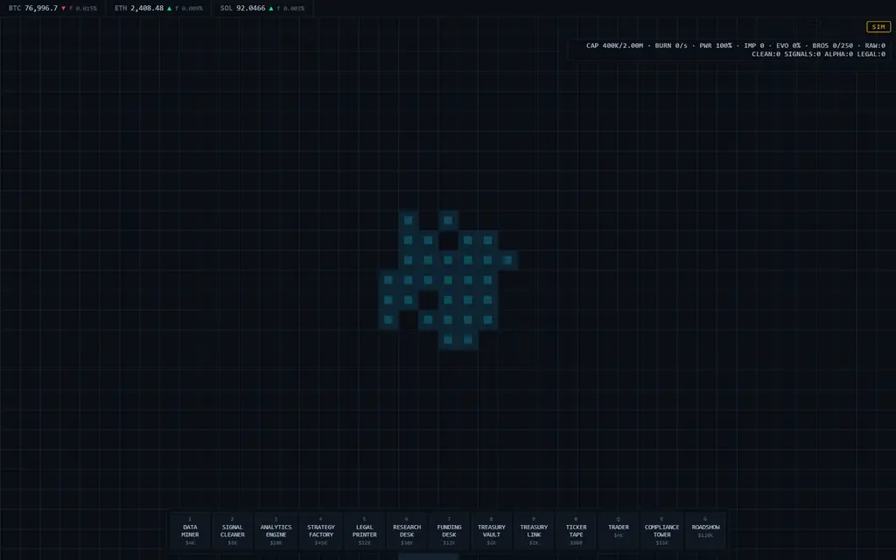
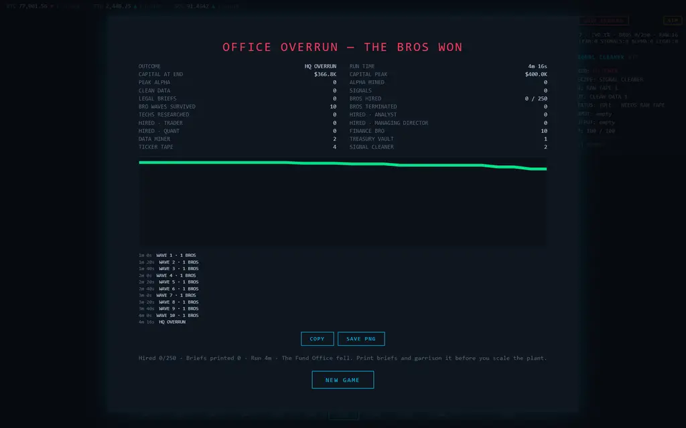
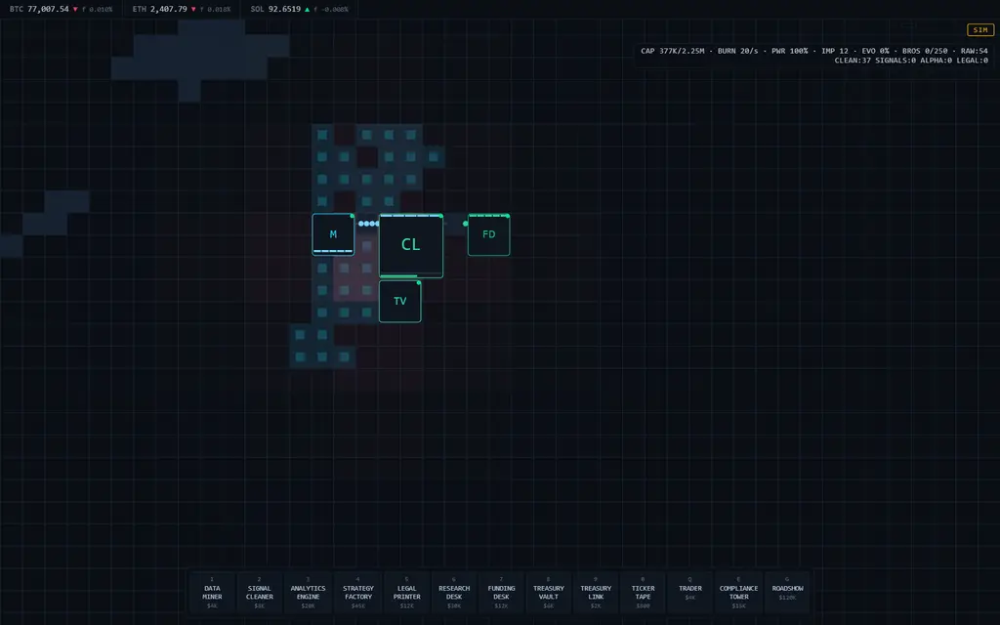
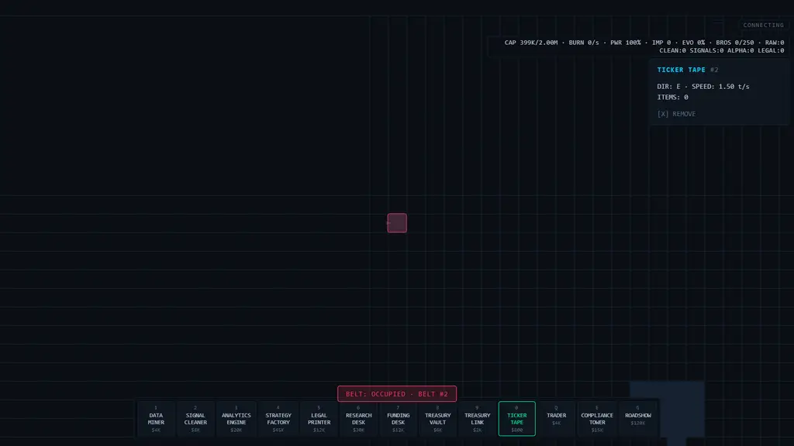

# Playtest log — HedgeFoundry

Graded evidence for the user-test phase: protocol, per-task result, timings, and the
one logged revision with before/after. Build under test is the **shipped production
bundle** (`npm run build && npm run preview`), not the dev server.

| | |
|---|---|
| Date | 2026-08-27 |
| Build | `dist/assets/index-CmUFpEQL.js` (65.79 kB, 23.71 kB gzip) |
| Surface | `http://localhost:4173/?debug`, Chromium 1440×900 |
| Input | synthetic mouse/keyboard through the real DOM event handlers |
| Long-run source | `src/sim/reachability.test.ts` (headless, 30 ticks/s) |

`?debug` only exposes the `window.__HF` world handle (`src/main.ts:378`); it is off on
the graded URL on purpose, so a visitor cannot script a live game.

## Method and its honest limit

The five tasks below were driven by scripted input — real `mousedown`/`keydown` events
dispatched to the canvas at ≥2× human cadence, with state read back from the running
world and the DOM after each action. This catches wiring, economy, and copy bugs
reliably and is repeatable to the millisecond. It does **not** measure whether a person
can find the controls, so every finding here is about behaviour, not discoverability —
except finding F1, which was confirmed by the one place a script behaves like a confused
human: it kept repeating an action the game could never accept.

Audio, and a first-time player reading the HUD cold, are untested (see Limitations).

## Protocol and results

| # | Task | Result | Evidence |
|---|---|---|---|
| T1 | Start a run, place the first line (miner → belt → cleaner → belt → funding desk, plus vault) | **PASS** | Costs debit exactly: miner −$4,000, vault −$6,000 (cap → 2.25M), full five-object line −$26,800 (800 + 8,000 + 12,000 + 6,000) |
| T2 | Get capital rising from a funded sale | **PASS** | +$8,015 in 35 s of live client time; desk reports `SELLS: CLEAN · SELLING CLEAN DATA → $250/s`, `BURN 20/s`, tape 54 / clean 37 |
| T3 | Survive bro pressure for minutes, not seconds | **PASS** | 181 frames/s sustained, zero console errors; 50 sim-minutes run 227 s of wall clock with HQ alive (`state=playing at 50.0m`) |
| T4 | Diagnose and fix a machine that is not working | **PASS after revision** | Inspector prints `GRID: NO POWER` vs `POWERED`, `JAM`, `STATUS: IDLE · NEEDS FUEL`; blocked placement failed pre-revision (F1) |
| T5 | Lose properly and learn from the report | **PASS** | HQ destroyed → `state=lost`, overlay `opacity:1`, title `OFFICE OVERRUN — THE BROS WON`, report lines, `NEW GAME` restarts |

## Timings

| Measurement | Value |
|---|---|
| Frame rate on the production bundle | 181 frames/s over a 3 s window |
| Click → world effect | 106 ms (one world tick, `timeMs` 2,784 → 2,890) |
| Money loop verified over | 35 s live, +$8,015 net of $20/s burn |
| 50 sim-minutes (build → IPO attempt) | 227 s wall, headless |
| Boot → accepting input | one `START` click; no load gate |
| Loss detected | `hq` at 4 m 16 s of run time, unattended line |

## Findings

**F1 — a blocked placement did not tell you what was in the way (real, fixed).**
With a build tool armed, clicking a tile never selects: the place path runs first
(`src/ui/build.ts:104`). A refused click toasted only `BELT: OCCUPIED`, so the player
could not see *which* object sat on the tile, could not open its inspector, and so could
not reach the `[X] REMOVE` affordance that the inspector does print
(`src/ui/panel.ts:129`). The trap is easy to fall in: a 3-wide cleaner built flush
against a 2-wide desk leaves no tile for the belt between them, and there is no move
tool — the only repair is demolish. Observed cost before the fix: four refused clicks,
two tool toggles, and one machine demolished by mistake before the cause was visible.

**Not findings — withdrawn after checking the source.** Both looked like defects while
driving and are automation artifacts, recorded so they are not "fixed" later:

- *Demolish seemed broken.* It is select-then-`X` (`src/main.ts:323`); my script pressed
  `X` with a stale selection and correctly demolished a different machine — refund was
  exactly half (miner $4,000 → +$2,000; desk $12,000 → +$6,000).
- *Placement seemed to ignore clicks.* Input is sampled once per frame; synthetic events
  landing inside one frame are legitimately invisible to the poll. Clicks that straddled
  a frame registered immediately.

**Open, unproven — float-position bro stall.** A fractional tile centred on a live
machine's impact cell produced 0.0 tiles of office progress in 6 s, where the same cell
with the machine switched off advanced 8.2 tiles. Only integer tiles are covered by the
harness, so this is a lead, not a conclusion.

## The logged revision

F1 is the one revision. On a refused placement the game now names the blocking entity
and selects it, so the inspector (with its `[X] REMOVE` line) opens on the thing in the
way.

```ts
// before — src/ui/build.ts:106
if (err) {
  this.cb.onDeny();
  this.cb.toast(`${this.tool.toUpperCase()}: ${err}`);
}

// after
if (err) {
  this.cb.onDeny();
  const blocker = this.world.entityAt(tx, ty);
  this.cb.toast(`${this.tool.toUpperCase()}: ${err}${blocker ? ` · ${blocker.kind.toUpperCase()} #${blocker.id}` : ""}`);
  if (blocker) this.cb.onSelect(blocker);
}
```

| | Before | After |
|---|---|---|
| Toast on a blocked tile | `BELT: OCCUPIED` | `BELT: OCCUPIED · BELT #2` |
| Inspector after the click | unchanged (stale selection) | opens on the blocker: `TICKER TAPE #2 · DIR: E · ITEMS: 0 · [X] REMOVE` |
| Clicks to repair a mis-laid lane | 4 refused + 2 toggles + 1 wrong demolish | 1 click, then `X` |
| Guard test | none | `src/ui/build.dom.test.ts` → "names the blocking entity and opens its inspector" |

## Screenshots

| | |
|---|---|
|  | Boot: plot, tape pools, build bar, live HUD |
|  | Loss overlay with the end-of-run report |
|  | Producing line, capital rising, all machines powered |
|  | Post-revision refusal: blocker named, inspector open |

## Balance observations

- Funding economics are no longer a death spiral: T1 line nets ≈ +$230/s against
  $20/s burn, which funds the first defensive tier without hoarding.
- The 250-hire quota is not the binding constraint — a plant reaches it inside 50
  minutes. Winning is gated on legal cover: unattended, the run loses the office at
  4 m 16 s and legal doc output is the throttle on `IPO PROGRESS`.
- A research desk shares one intake pad across two ingredients, so research starves
  unless the plant keeps a surplus. That cap is real and stays. It is **not** what
  held the 50-minute run at fuel tier 1 for its last 46 minutes — that was a
  delivery bug: machine output was pushed only on the tick a craft completed, so a
  single refusal stranded the units permanently (`docs/DESIGN.md` §12b, and
  `src/sim/logistics.test.ts` now guards it).

## Limitations (what a human pass still owes)

1. No human hand has played it: no evidence yet on whether the tool lock in F1 is
   discoverable, or how long the first line takes to lay on purpose.
2. Audio is unverified (headless surface).
3. Long-run numbers are headless 30 ticks/s, so they understate browser stutter under
   load; 181 frames/s was measured on a five-machine plant, not a 50-minute end state.
4. Live-feed UI is not shipped yet (`.omp/plans/2026-08-27-game-completion.md` P5), so
   the tape pool shown here is the simulated feed.
